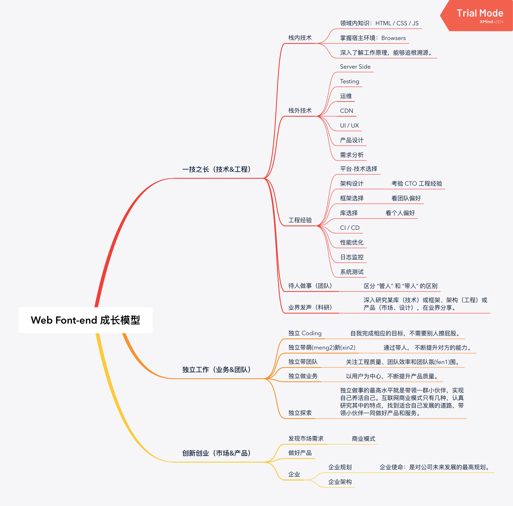

# 一个程序员的成长之路  

> 主题：主会场 - 一个程序员的成长之路  
> 时间：2018年5月19日 10:40  
> 地点：中国 上海  
> 演讲嘉宾：张云龙-全民直播-CTO  

## 第一章 程序员的中年危机

**Question1**: 我面试过许多前端工程师，发现大家在工作了 3 - 4 年的时候会遇到一个迷茫期。当我问他们接下来有什么计划的时候，大多数人回答说想做一个开源项目，并且推广开来，成为前端“网红”，更长远的职业发展规划往往考虑的很少。

**Answer1**: 要对自己的职业规划，进行高层设计，并且不断优化！  
* `核心思想`：成为一名项目驱动型工程师，做出有价值、高质量的产品和服务。  
* `阶段划分`：一技之长 - 独立工作 - 创新创业。    
* 很多的工程师没有总结自己工程经验的能力，我面试经常会问，你们觉得自己工作了两年、三年、四年和刚毕业的学生有什么差别？面试者说掌握了某某技术，但其实往往说的只是一些知识点。那些“今晚查完明天就会了的”不叫技术。**决定你比别人更有专业价值的，其实是领域工程经验**。你看过再多的文章也没有用，没真正实操过都不能称之为“掌握”。所以我建议要想掌握足够丰富的工程经验，需要在业务中多争取实践的机会。  

**Question2**: 我今年 33 岁，虽然有技术傍身，但是难免会有一些焦虑，这种焦虑来自对自己的能力质疑。在大公司的那些年，背靠大平台，做出的成绩 80% 是平台赋予我的，它有 **健全的体系** ，有 **优秀的同事** ，有 **完善的职级制度** ，还有 **优厚的薪资待遇** 。你在这样舒适的环境下做那么一小块事情，如果有一天你发现你这 20% 可以被替代的时候，这家公司会怎么思考？你有很多股票，开很高的工资，对于公司来说，你的成本(cheng2ben3)很高，在新人的推动下，你会产生一种可被替代的压力，我大概在 28 岁，29 岁技术水平还在上升期的时候就有这种焦虑。

**Answer2**: **焦虑** 来自漫无目的的奋斗，清楚自己想要什么，然后树立 **合理的目标** ，逐渐达到。  

  
>* 在大公司的那些年，始终没有脱离学生气 *(责任意思、奋斗(fen)精神、精湛的技术实现、严谨(jin)的工程过程、适当的人际关系处理)*；
>* 技术更新迭代速度太快，可沉淀的知识太少 **(专注技术的核心价值)**；
>* 企业如何对待 35 岁以上的员工；
>* 随着年龄的增长，选择成本会越来越高 (不要用年纪、家庭、地域来约束自己)；

**保留学生时代钻研精神，发扬工作中实践精神。技术的原理与目的都没有改变，只是实现的方法和应用的场景发生改变。终生学习，值得不仅仅是技术工程能力，更重要的是思维模式的演变。家庭不是个人发展的绊脚石，要把家庭的结合作为自己人生的助力！**

>* 技术要深入到什么程度？
>* 技术总要转型管理？
>* 我想做什么，我能做什么？
>
> 我们做技术，尤其是前端，很多时候我们做出的产品，看到的都是 UI 设计 / 交互设计 / 产品设计，即便我们做的产品非常成功，成功点在哪儿？可能是 UI 设计得漂亮，也可能是推荐算法精确，而前端的产出给产品带来了什么？还有前端技术深要深到什么程度？做久了技术就必须要转型管理吗？这些问题我当年没有答案，我可以坚持不懈得写页面，但是这个事情做 5 年，6 年，10 年不还是一样吗？现在我能做什么？未来我想做什么？
> 
> 百度（3 年技术）-> UC（2 年团队）-> 全民直播（2 年业务）
> 
>* 最开始的 3 年我在北京，那个时候刚毕业，还不能决定自己的未来，加入百度算是比较运气。当时花了些精力准备一份漂亮的简历，这件事对我找工作帮助很大。在学校的时候，基本上对前端这块已经非常熟悉了，我的简历非常漂亮。最开始刚毕业的时候选择工作，简历会成为一个好门面。我把当时自己在前端的方向、学习深入的点，都花精力体现在简历上，当时在大公司招聘的时候已经占了一些优势，很荣幸的是被百度接收了。    
>* 在百度三年时间里面，主要在做技术。当时百度有一个很大的前端团队，一百多人，包括百度新闻，百度视频，百度知道，百度百科等等，整个团队为了解决开发效率问题，决定成立一个横向支撑的小组，做一款构建工具，就是 `fis`，我当时还在 `CMS` 部门(一个内部的内容管理系统)，主动提出参与到 `fis` 项目中。做 `fis` 的过程让我学到了很多服务端技术，包括运维知识。  
>* 在百度工作 3 年后，开始想着开始去脱离这个平台 80% 的支撑，我当时认为 UC 是一个中型的创业公司，我过去待了两年多，那个时候开始关注前端团队建设。把我在百度学习到的技术理念在 UC 结合 `node.js` 重新实践一遍，其次是指导前端团队提高他们整体的技术水平。    
>* 在广州 UC 工作 2 年后，来到了上海，参与全民直播这个项目。做全民直播的整个过程经历了比较多的坎坷，我最开始接手全民的时候，仅有两个全民自己招聘的研发同学，经过 2 年多的时间，组建了将近一百人的团队，包括服务端，前端，客户端，测试，运维，编解码，大数据等部门。感觉在上海这两年的成长，比前面在大公司所有 5 年的加起来还多。（这里要反驳张先生，不要将各方向技术进行单方向叠加！）   

**由前端工程师向全栈工程师转变，这是路径(jing4)。根据已有的工程经验和技术储备，独立完成项目，并持续优化项目，这是目的。管理是横贯整个职业生涯的基础要求，从来没有单纯的管理岗位，从来没有脱离工程技术的管理人员，真正的管理人员就是最卓越的工程师。**  

**人的精力是有限的，不要看 UI 好玩就去花费大量的时间去练习设计、不要觉得市场好玩就去花费大量的时间去做市场，要专注于核心价值体系，即：前端产品、前后端交互、后端逻辑处理、大数据处理、人工智能。**  

**大公司的优势：**  
* 健全的工作流体系；  
* 优秀的同事；  
* 完善的职级制度；  
* 丰厚的薪(xin1)资待遇。  

**大公司的劣势：** 
* 技术片面-专业化；  
* 片面-专业化的技术面可被替代。

## 第二章 成长模型

> 剖析别人的履历，观察别人的关注点和做成的成绩，以及各个事务内在的联系，对自我的成长非常有利。

> 个人成长模型：一技之长（技术&工程）- 独立工作（业务&团队）- 建立事业（市场&产品）

  

## 第三章 三十而立

### 1.CTO 真实生活

**招聘**：招聘面试是我平时要做的事情，我们有专门的 HR 团队，我会把我的帐号给人事的同学去登录，勾搭别人，有一些专业的高端人才，我会一直保持联系，寸志老师就是这样被我勾搭过来的 

**技术团队的组织架构**：我要参照曾经的经验设计一家公司的架构，一家公司的发展你要在不同的阶段做不同的调整，比如大数据，运维这样的团队，早期我会统一管理，随着公司发展，会考虑独立出来做特色的东西，不要受业务的干扰，这是组织架构。  

**战略目标**：还有就是经常跟 CEO 聊天，游湖散步，把他的 **战略目标拆解成技术目** 标落地实现。  

**跟合作厂商的沟通协作**：创业公司需要借助各方力量，我可以通过置换商业资源的方式寻求行业其他公司的技术帮助，加快产研速度。

### 2.员工薪资、奖金和期权的确定

* 薪资：是一个人的未来能带来的收益的考量，它是一个市场价值，一个人不管来这家公司做出多少业绩，他达到这个水平，就要给他薪资；  

* 奖金：是做出业绩的回报，是一个人过去做过的事情的价值衡量；  

* 期权：如果这家公司对这个人充满希望，你可以用一部分的薪资奖金兑换成期权，降低公司的成本。    

这是三者的关系。充分理解薪资、奖金、期权的关系，是一个 CTO 要关注的事，有助于建设良好团队氛围。

### 3.如何建立良好的团队氛围

如何建设好团队工作氛围？除了前面说到的待遇问题，还有很多举措可以用于建设良好的团队氛围。我是偏理性的管理者，我基本上不太会用个人关系，比如天天吃饭来去维护这个，我比较认可通过 **完善的机制** 来建设公平的环境，带领好的氛围。另外，好的氛围的根本，取决于业务，业务不向上，基本上你怎么做都是不好的氛围。

### 4.管理是工程实践的一部分
管理的五种类型：老虎型、考拉型、孔雀型、猫头鹰型、变色龙型
